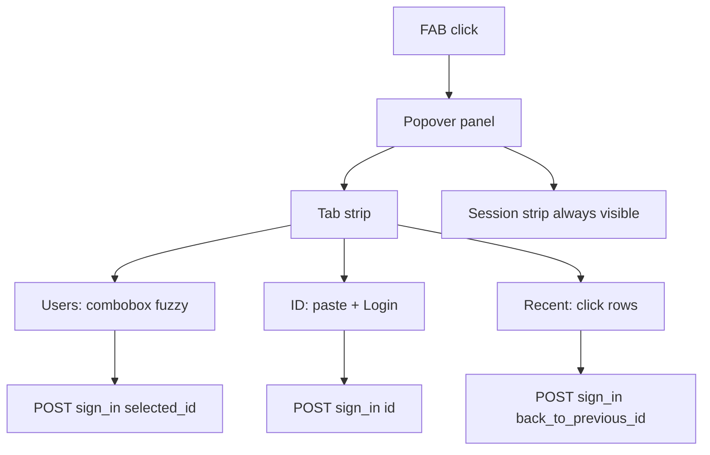

# Light Plan: AnyLogin tabbed panel + fuzzy user combobox

## Accepted Task
- **Task:** Evolve the forked AnyLogin dev UI from a single stacked form into a modern tabbed panel: (1) searchable user list with click-to-login, (2) user ID paste tab, (3) recent users tab. Keep the floating FAB; polish visual design.
- **Why this qualifies as light:** Changes stay inside the `any_login` engine (views, inline CSS/JS, small helpers). No Wordee app logic, no schema/migrations, no production enablement. Dev-only surface with existing `verify_access_proc` and sign-in POST unchanged.

## Simplest Correct Version
- **What we will build:**
  - **FAB unchanged** — same corner trigger and popover shell.
  - **Header:** title + close; **compact tab strip** under header: `Users` | `ID` | `Recent` (icons optional).
  - **Footer (always visible):** current session as a slim status strip (email + monospace ID), not a fourth tab.
  - **Users tab:** combobox pattern — search input, dropdown list filtered with **client-side fuzzy match** on display label (and optionally ID substring). **Click row → login** (POST with `selected_id`, same as today’s select `change` handler).
  - **ID tab:** single monospace field + primary **Login** button (`params[:id]`).
  - **Recent tab:** vertical list of recent accounts (from cookie); **click row → login** (`back_to_previous_id`). Empty state copy when no history.
  - **Respect `AnyLogin.login_on`:** hide/disable tabs that config disallows (`:select`, `:id`, `:both`); default active tab = first visible.
  - **Grouped collections:** when `collection_method` returns grouped hash, Users list shows section labels when not searching; when searching, flat results with small group badge on each row.
- **Existing pattern to reuse:**
  - Sign-in: `POST any_login.sign_in_path`, `ApplicationController#user_id` precedence unchanged.
  - User labels: `AnyLogin::Collection` + `name_method`.
  - History: `any_login_previous_ids` cookie + `AnyLogin.klass` lookup.
  - Panel chrome from current `_css.html.erb` (zinc tokens); extend, don’t replace engine mount.
- **What we intentionally avoid:**
  - No new gem dependencies (no Stimulus/React/npm in the engine).
  - No server-side search API in v1 (embed capped user list in page; see assumptions).
  - No redesign of auth providers or initializer option names.
  - No Wordee-specific CSS; all changes in `~/open-source/any_login`.

## Non-Goals
- Paginated or server-side user search across full DB when `limit` is `:none` and thousands of users exist.
- Keyboard shortcut to open panel (e.g. ⌘K) — nice follow-up.
- Theming hook / CSS variables API for host apps.
- Replacing Wordee’s Phlex `render_any_login` wiring.
- Upstream PR packaging, appraisal CI green, or changelog until implementation is smoke-tested in Wordee.

## Assumptions
| Assumption/default | Why reasonable | Verification |
| --- | --- | --- |
| Dev user count stays within `AnyLogin.limit` (default 10) or host raises limit modestly (e.g. 50–200) for combobox | README already documents `limit`; Wordee dev DB is small | Check Wordee `any_login` initializer / defaults; list size in rendered JSON |
| Client-side fuzzy on embedded `[{label,id,group?}]` is enough for v1 | Matches “search on the fly” for typical dev datasets | Manual: type partial email, see filtered rows |
| `login_on` still drives which tabs exist | Preserves upstream config contract | Set `config.login_on = :id` in dummy app; only ID tab shows |
| Recent tab only when `any_login_previous_ids` non-empty | User asked for third tab; empty state is acceptable | Fresh browser vs after one switch |
| Inline `<script>` + CSP nonce remains valid | Current partial already uses `content_security_policy_nonce` | Load Wordee with CSP meta; no console violations |
| Click-to-login on Users/Recent can drop explicit Login button on those tabs | Faster UX; ID tab keeps button | Manual flows on all three tabs |

## Implementation Steps
| Step | Change | Verify |
| --- | --- | --- |
| 1 | Add helper `any_login_users_payload` → JSON-safe array of `{ id, label, group }` from `AnyLogin.collection` (flatten grouped). Add `any_login_recent_users_payload` for history list (same shape, no group). | Unit-less: render in console/view and inspect JSON length ≤ limit |
| 2 | Refactor `_any_login.html.erb`: tab buttons (`role="tablist"`), three panels (`role="tabpanel"`, hidden except active), hidden fields `selected_id` / `back_to_previous_id`, Users combobox markup (input + `ul` listbox), ID fields, Recent list. Session strip outside tab panels. | HTML shows one visible panel; a11y roles present |
| 3 | Extend `_css.html.erb`: tab strip (underline active), combobox (focus ring, list max-height + scroll, row hover), recent rows as buttons, empty states, tighter spacing/typography (slightly larger radius, subtle blur optional). | Visual pass in Wordee dark layout |
| 4 | Rewrite `_js.html.erb`: tab switching (persist active tab in `sessionStorage` optional); fuzzy filter (normalize case, score: substring + word-start + subsequence); keyboard (↑↓ Enter Esc) for combobox; row click sets hidden input + `form.submit()`; remove auto-submit on native `<select>`; keep click-outside/Escape to close panel (not combobox only). | Manual keyboard + mouse on Users tab |
| 5 | Map `login_on` in ERB/JS init: compute visible tabs; if only one mode, hide tab strip and show that panel only. | Appraisal devise dummy or Wordee with each config |
| 6 | Deprecate/remove visible `any_login_select` and history `<select>` from main template (helpers can remain for backward compat or be unused). | No duplicate controls in screenshot |
| 7 | Smoke in Wordee (`path` gem): switch user via search, via ID, via recent; confirm cookie history updates. | `bin/dev` + browser |
| 8 | Commit on fork; note in commit message UI-only + behavior parity. | `git log` |

## Verification
- **Automated:** Optional: add a minimal system test in gem’s `test/rails_apps/devise` that GET home includes `data-any-login-users` and tab markup — only if quick; not blocking v1.
- **Manual (Wordee):**
  - Open FAB → default **Users** tab.
  - Type fuzzy fragment of email → list narrows → click → redirected signed in as user.
  - **ID** tab → paste UUID → Login.
  - **Recent** tab → click prior user.
  - Session strip shows correct email/ID after each switch.
  - Escape closes panel; click outside closes panel.
- **UI tester scheme:** `browser-tester` (localhost Wordee, dev login enabled).
- **Missing setup:** None if Wordee dev server + DB with multiple users; otherwise seed 3+ users.

## Built-In Review Result
- **Review method:** light-planner built-in full review
- **Issues found:**
  - Large `limit: :none` could bloat HTML/JSON — mitigated by documenting cap in PR and optional future search endpoint.
  - Grouped collections need explicit UX when filtering — addressed with group badge in step 1.
  - `login_on: :both` vs three tabs — Recent is independent of `login_on`; Users + ID tabs still gated by config.
  - Security: embedded user list only when `AnyLogin.enabled` + same layout gate as today — no new leak surface if production stays disabled.
- **Changes made after review:** Added grouped-collection behavior, `login_on` tab gating, and explicit non-goal for server search API.
- **Escalation needed:** **no** (if implementation discovers need for async user search at scale, split follow-up or escalate then).

## Execution
Execution not started.

To implement, say: **use plan-executor with `~/open-source/any_login/docs/plans/2026-06-24-light-any-login-tabs-combobox.md`**

## UX reference (target behavior)
